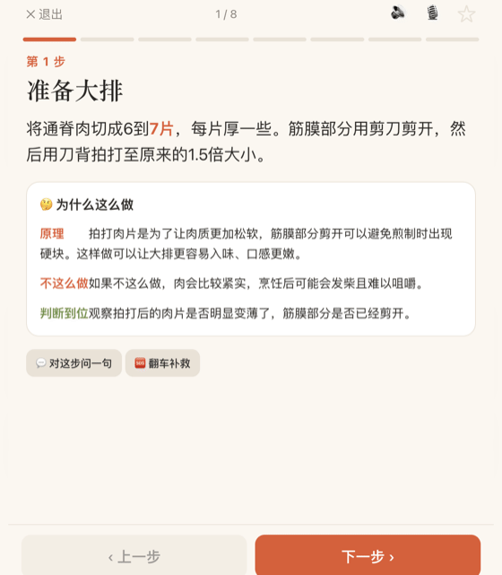
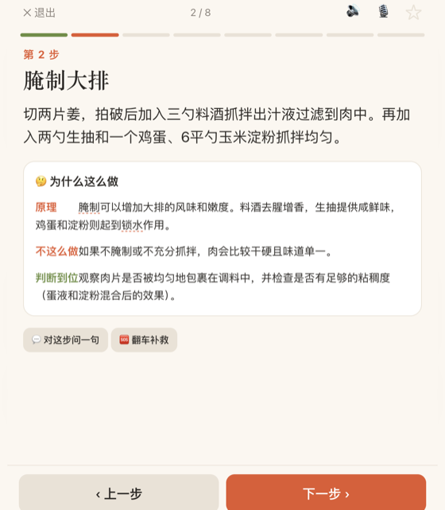
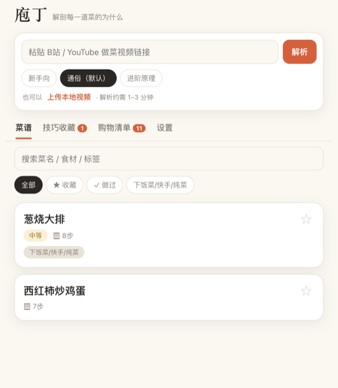
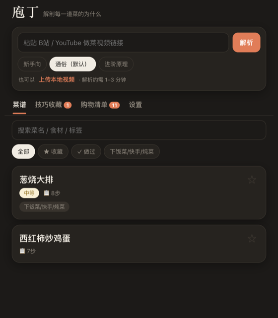

<div align="center">


# 庖丁 · Paoding

**把做菜视频拆成分步骤，讲透每一步「为什么这么做」。**

_Turn any cooking video into step-by-step instructions that explain the **why** behind every move._

<p>


</p>

<p>
<a href="README.md"></a>
<a href="README.en.md"></a>
</p>



</div>

---

## 这是什么

给它一个做菜视频（B站 / 抖音 / YouTube 链接、本地文件），**或一段图文/文字帖**（小红书 / 公众号 / 任意粘贴的文字），庖丁会：

1. **听懂它** —— 视频走「下载音频 → 语音转文字」；文字帖直接读文字（口播/文案是做菜内容里最值钱的信息）。
2. **拆成步骤** —— 大模型整理成结构化菜谱：食材（含 `qty/unit` 可精确缩放）、火候、时间、到位判断。
3. **讲透为什么** —— 对**每一步**生成三段式讲解：
   > 🤔 **为什么这么做** ｜ **不这么做会怎样** ｜ **怎么判断到位了**
4. **陪你做** —— 手机 App + 电脑桌面双端：一步一屏、语音免手、多计时器、AI 随问、本步用到的食材高亮。

## 为什么不一样

市面上"视频转菜谱"的工具不少，但它们只给你一份**扁平菜谱**——告诉你*做什么*，不告诉你*为什么*。而讲原理讲得好的（America's Test Kitchen、ChefSteps）又是人工编辑、不吃你随手刷到的视频。

**庖丁把两者缝在一起**：自动解析任意视频 × 每步深度原理讲解。你不只是照着做，而是**搞懂**——为什么油要七成热、为什么先焯水、为什么这步省了会翻车。

| 维度 | 庖丁 | Mealie v3.13+ | ReciMe / Deglaze 类 | ATK / ChefSteps 类 |
|---|---|---|---|---|
| 视频音频转写 | ✅ | ✅ | ✅ | ❌ |
| 画面级理解（VL/OCR） | ✅ 可选 | ❌ 主要用音频转写 | ❌/未见明确支持 | ❌ 人工制作内容 |
| 每步状态截图 | ✅ 自动截原视频 | ❌ | ❌/少见 | ✅ 人工拍摄 |
| 每步为什么 | ✅ 自动逐步解释 | ❌ | ❌ | ✅ 人工编辑 |
| 中文平台（B站/抖音/小红书） | ✅ 重点支持 | ❌ | ❌ | ❌ |
| 自托管零成本 | ✅ Ollama + whisper.cpp | ✅ 开源自托管，生态/多用户/i18n 更成熟 | ❌ 商业 App | ❌ 内容站/课程 |
| 多用户/权限/i18n | ✅ household token 隔离 | ✅ 强 | ⚠️ 取决于产品 | ⚠️ 非菜谱管理系统 |

<div align="center">

</div>

## 功能

| | |
|---|---|
| 🎬 **智能解析** | 粘链接（B站/抖音/YouTube）或传视频，**实时进度 + 排队**、可后台化；手机可从别的 App 分享链接直接解析 |
| 🔎 **读画面字幕** | 可选视觉 OCR（qwen2.5-VL）：抽帧读屏上字幕/画面，**兜住没口播、只有字幕的视频** |
| 📸 **画面配图** | 从原视频截出**每步的状态图**（“鸡蛋煎到什么样”一眼看到）和**食材/小料特写**（视觉定位+裁剪）；时间戳定位、视觉模型挑帧复核，找不到就不硬配 |
| 📝 **文字/图片也能解析** | 除视频外：**粘贴小红书图文/公众号/任意文字帖**，或拍菜谱书/手写菜谱/截图多图导入；贴链接时自动兜底抓网页文字 |
| 📱 **双端一套** | 手机装成 App（Capacitor 安卓 APK）+ 电脑桌面响应式；同一后端、改一处两端同步、检测到新版**自动更新**（免重装） |
| 📖 **跟做模式** | 一步一屏 / 大字 / 屏幕常亮 / 进度条 / 左右滑 / 断点续做 / **本步用到的食材高亮** |
| 🤔 **每步为什么** | 三段式原理讲解，关键信息（火候/时间/用量）高亮，术语可点开秒懂 |
| 🧠 **跨菜技法库** | 自动聚合同一技法在不同菜谱里的出现位置、步骤做法和 why 摘录，可跳回对应菜谱步骤；可一键 AI 归纳“什么时候用 / 关键判断 / 常见翻车点”，结果落盘缓存 |
| 🎞 **跳回原视频** | 每步可跳回 B站 / YouTube 对应时间段；不支持时间戳的平台只打开原链接 |
| 🎙 **免手操作** | 语音说「下一步 / 上一步 / 朗读」翻页，朗读当前步骤（洗手做菜刚需） |
| ⏱ **多计时器** | 从步骤自动识别时长，多个并行、跨步骤保留、到点响铃+震动+系统通知 |
| 💬 **AI 助手** | 对每步追问、🆘 翻车补救、食材替代（**该替就替、不能替直说**）、整菜设计、结构化营养估算 |
| 🧺 **食材 & 购物** | 份量缩放（按 `qty/unit` 精确重算）、食材行可点开**中餐单位速查**（勺/克/两/毫升等）、购物清单**同名合并 + 按超市货架分区**，本周计划展示每日营养合计与周日均，支持多菜同做时间线 |
| ✏️ **可编辑** | AI 出错能直接改：标题/用量/步骤/讲解随手修正，食材/步骤可增删和上移下移，标签可直接编辑，保存即同步 |
| 🏠 **多用户** | `PAODING_API_TOKENS` 支持家庭多用户：菜谱共享，收藏/笔记/评分/购物清单/本周计划/最近任务按 token 隔离 |
| ☁️ **同步 & 备份** | 收藏/笔记/评分/购物清单**跨设备共享**（手机↔电脑）；一键导出备份 / 导入恢复，服务端自动定期备份 |
| 🔄 **生态互通** | 导入单个 **schema.org Recipe JSON-LD**；复制 Markdown、下载 **Cooklang `.cook`** 与 **schema.org JSON-LD**；详情页一键打印/PDF（保留标题、来源、食材、步骤和每步 why）；公开分享页可导出 JSON-LD，方便复制到自己的庖丁实例 |
| ⭐ **收藏 & 记录** | 收藏整菜 + 收藏单步技巧、笔记、做过打卡 + 评分，菜谱库支持搜索、标签/食材/快捷筛选和按最近/评分/时长/名称排序 |
| 🌙 **顺手** | 暗色模式、字号、朗读语速、装到主屏（PWA）、离线看已解析菜谱、双指缩放 |
| 🛡 **诚实** | 视频没讲清的绝不臆造，如实标「视频未明确」；每步带置信度，靠推测的会标「⚠️ 推测」 |
| 🧰 **自托管** | Docker / Compose 可复制部署；APK 首次启动填自己的后端地址，不再绑定私人服务 |

<div align="center">
&nbsp;&nbsp;

</div>

## 管线

```
视频URL / 本地文件                     图文帖链接 / 粘贴的文字            拍照 / 截图
   → [yt-dlp]  下载音频 + 标题/简介         → [fetch]  抓网页文字(og/正文) 或直接用粘贴内容
   → [ffmpeg]  抽音轨（16k 单声道）                       │
   → [ASR]     口播转文字(whisper.cpp/云，带时间戳)        │
        └──────────────┬──────────────────────────────────┘
                       ↑
              [视觉] 原样转录图片里的菜谱文字
                       ↓
                → [LLM]  整理成结构化菜谱 JSON（食材 qty/unit、火候、时间、每步对应的视频时间段…）
                → [LLM]  逐步生成「为什么」讲解     ← 庖丁的核心差异
                → [视觉] （可选）按每步时间段抽候选帧 → VL 挑最能体现状态的一张；
                          识别食材画面 → 定位裁特写（找不到就不配，绝不硬凑）
                → JSON + Markdown(嵌图) + 双端跟做（可导出 .cook / JSON-LD）
```

> 视频抓不到时（如小红书无 yt-dlp 抽取器）会**自动改按文字帖**抓网页文字；纯图文/文字帖直接走右侧文字管线。

拍照/截图导入依赖视觉模型：需要配置 `PAODING_VISION_MODEL`。未配置时 `/api/parse-images` 会直接返回「需配置视觉模型」，不会尝试臆造菜谱。默认一次最多 6 张图、单张 8MB，可用 `PAODING_IMAGE_MAX_COUNT` / `PAODING_IMAGE_MAX_MB` 调整。

导入范围：设置页可粘贴或选择 `.json` 文件导入单个 schema.org `Recipe` JSON-LD（兼容 `@graph`、`HowToStep`、`HowToSection`）。Cooklang 目前支持导出，暂不支持导入。

## 快速开始

**依赖**：Node 22+、`ffmpeg`、`yt-dlp`（解析在线链接用），以及大模型+ASR（本地或云端）。

### 方案 A：全本地零成本（推荐，Mac 首选）

```bash
# 大模型（Ollama 自带 OpenAI 兼容接口）
ollama pull qwen2.5:14b
ollama pull qwen2.5vl:7b   # 可选：视觉模型（读画面字幕 + 每步状态图/食材图）

# 本地语音转写
brew install whisper-cpp ffmpeg yt-dlp
mkdir -p models
curl -L -o models/ggml-large-v3-turbo.bin \
  https://huggingface.co/ggerganov/whisper.cpp/resolve/main/ggml-large-v3-turbo.bin

# 配置（默认就是本地方案）
cp .env.example .env
# 局域网/公网可访问时必须设置 API token；本机浏览器单独用可改为 PAODING_HOST=127.0.0.1
openssl rand -hex 16  # 把输出填到 .env 的 PAODING_API_TOKEN

# 起 App
node app/server.mjs
```

不花钱、不申请 key、视频不出本机。想提质量随时把 `.env` 里的 `PAODING_LLM_*` 换成云端旗舰模型（豆包 / Gemini / GPT / Claude 等任意 OpenAI 兼容接口），其余不变。

可选：`PAODING_OUTPUT_LANG=en` 会要求 LLM 用英文生成结构化菜谱、每步 why、营养估算、技法归纳和 AI 助手回答；默认 `zh` 不追加任何语言约束，保持现有中文输出行为。前端界面语言在 App 设置页切换，日期和数字格式暂不做 locale 化。

### 命令行（不开 App）

```bash
node bin/paoding.mjs ./红烧肉.mp4
node bin/paoding.mjs "https://www.bilibili.com/video/BVxxxx" --depth advanced
```

### 方案 C：Docker 一键起

```bash
cp .env.example .env
openssl rand -hex 16  # 填到 .env 的 PAODING_API_TOKEN

mkdir -p models
curl -L -o models/ggml-large-v3-turbo.bin \
  https://huggingface.co/ggerganov/whisper.cpp/resolve/main/ggml-large-v3-turbo.bin

docker compose up --build
```

默认会把菜谱写到 `./recipes/`，解析任务元数据写到同级 `./jobs/`，用户数据写到 Docker volume。若本机已跑 Ollama，`.env` 里的 `PAODING_LLM_BASE_URL` 可用默认的 `http://host.docker.internal:11434/v1`。

也可以让 compose 顺手起一个 Ollama：

```bash
docker compose --profile ollama up -d ollama
docker compose exec ollama ollama pull qwen2.5:14b
docker compose --profile ollama up --build paoding
```

## 装到手机

`node app/server.mjs` 启动后会打印**局域网地址**（如 `http://192.168.1.5:4177`）。手机连同一 WiFi 打开它 → 浏览器菜单「添加到主屏幕」→ 就是一个全屏 App。App 界面跑在手机、解析引擎跑在电脑，两者通过局域网通信。

默认监听局域网地址时会强制开启 API token；在 `.env` 设置 `PAODING_API_TOKEN`，再到 App「设置 → API Token」填同一个值。只在本机浏览器使用可设 `PAODING_HOST=127.0.0.1` 跳过强制鉴权。CORS 默认只允许同源与 Capacitor，跨域自托管前端可用 `PAODING_CORS_ORIGINS=https://你的域名` 放行。

### 多用户（household）

家庭共用一个后端时，可以用 `PAODING_API_TOKENS=alice:token1,bob:token2` 配多个用户 token。每个人在自己的 App 设置页填对应 token：菜谱库仍全局共享，收藏、笔记、评分、购物清单、本周计划和最近任务按用户隔离。只设置旧的 `PAODING_API_TOKEN` 时仍是单用户模式，继续使用原来的 `paoding-userdata.json` 文件。

> B站等平台反爬（HTTP 412）：`.env` 里设 `PAODING_COOKIES_FROM_BROWSER=chrome`，借用浏览器已登录的 cookie 即可。

解析服务默认同时跑 2 个任务，最多排队 10 个；可用 `PAODING_MAX_JOBS` 和 `PAODING_MAX_QUEUE` 调整。任务状态会写入 `jobs/`，服务重启后正在执行的任务会标为「已中断」，首页「最近任务」可看到并重新发起。

安全边界：服务端会在抓网页、下载视频前拒绝本机、私网与链路本地地址，避免把后端当成内网探测器。`yt-dlp` 仍可能跟随平台侧重定向；首跳会被庖丁拦截，公网部署时仍建议放在受控网络与鉴权之后使用。

### 自动备份

服务端会在 `recipes/` 同级创建 `backups/`，按间隔写入 `paoding-backup-<ISO日期>.json`。备份内容包含全部菜谱 `recipes`，以及默认用户和多用户模式下的全部 userdata 文件 `user_files`。

- `PAODING_BACKUP_INTERVAL_H=24`：默认每 24 小时备份一次；设为 `0` 关闭自动备份。
- `PAODING_BACKUP_KEEP=7`：默认保留最近 7 份，旧备份自动轮转删除。
- 启动时若最近一次备份已超过间隔，会立即补一份；`GET /api/backups` 可查看备份列表。

### 安卓 APK

Capacitor APK 不再写死任何个人后端地址；首次打开会加载本地设置页，填自己的后端地址和 API Token 后再使用。仓库也不再提供指向作者私人后端的 `paoding-debug.apk`，需要 APK 时请在本机执行 `npx cap sync android` 后自行打包。

## 自动部署

云服务器上的 Caddy 把 `/paoding/*` 反代到 `127.0.0.1:14177`，这个端口由 Mac 上的 `com.paoding.tunnel` 通过 autossh 反向转发到本机 `4177`。实际 App 服务由 Mac 上的 `com.paoding.server` 跑 `node app/server.mjs`。

服务端会兼容 `/paoding` 子路径：即使 Caddy 没有剥掉前缀，`/paoding/`、`/paoding/index.html` 和 `/paoding/api/*` 都会正常落到同一套 App。

仓库内置自动部署 workflow：`.github/workflows/deploy.yml`。每次 push 到 `main` 会在这台 Mac 的 `paoding` self-hosted runner 上执行；路径、launchd 服务名和健康检查 URL 都集中在 workflow 顶部 `env:`，fork 后按需改一处即可。

1. `git pull --ff-only origin main` 更新部署目录
2. `npm test`
3. 重启 App launchd 服务
4. 重启隧道 launchd 服务
5. 校验本机和公网健康检查 URL

## 目录

```
src/            解析引擎（download / fetchText / transcribe / chef / explain / pipeline）
bin/paoding.mjs 命令行入口
app/            跟做 App / PWA（index.html + styles.css + app.js + sw.js + server.mjs）
android/        Capacitor 安卓工程（npx cap sync android 后 gradlew 打 APK）
Dockerfile      自托管镜像（内置 ffmpeg / yt-dlp / whisper.cpp）
docs/           产品需求与技术方案
```

产出的菜谱 JSON（每步含 `why`、`risk_level`、`confidence`）就是 App 的数据契约。

## 测试

```bash
npm test
# 等价于：node --test test/*.test.mjs
```

纯 Node 内置测试器、零第三方依赖：覆盖解析纯函数、服务端接口、前端 `app.js` 纯逻辑（含单位速查与打印 why 文本）、schema.org 导入/导出、图片导入、技法聚合与归纳缓存、自动备份纯函数与管线集成测试。管线测试使用 `test/fixtures/bin/` 里的 fake `yt-dlp` / `ffmpeg` / `whisper-cli`，并用 OpenAI 兼容的 fetch stub 覆盖 LLM/VL JSON 重试与图片转录。GitHub Actions 每次 push / PR 自动跑（`.github/workflows/test.yml`）。

## Roadmap

- [x] 文字帖解析（小红书图文 / 公众号 / 粘贴文字）+ 视频抓不到时自动兜底
- [x] Capacitor 打包安卓 APK + 桌面响应式（双端一套代码）
- [x] 跨设备同步收藏/笔记/评分/购物清单 + 导出备份
- [x] 菜谱可编辑、结构化用量份量缩放、购物清单智能合并、导出 Cooklang / schema.org
- [x] 抽帧 + 视觉 OCR（qwen2.5-VL），兜住「没口播只有字幕」的视频（前端「读画面字幕」开关）
- [x] 画面配图：时间戳定位每步 → 截「到位状态」截图；食材/小料识别 + 视觉定位裁特写（前端「提取画面截图」开关 / CLI `--images`）
- [x] 本周膳食计划（周日历排菜 → 一键合并购物清单 → 每日营养合计 / 周日均）
- [x] 多菜同做时间线（主动步骤串行、被动等待可穿插，尽量同时上桌）
- [x] 菜谱结构编辑增强（食材/步骤增删与上移下移、标签直接编辑）
- [x] household 多用户隔离（菜谱共享，用户数据和最近任务按 token 隔离）
- [x] 公网安全加固：强制 token、CORS 收紧、SSRF 过滤、LLM 接口限流
- [x] Docker / Compose 自托管 + APK 后端地址运行时配置
- [x] 每步跳回原视频时间段（B站 / YouTube 时间戳）
- [x] 结构化营养估算落库、缓存失效、JSON-LD 导出
- [x] schema.org Recipe JSON-LD 导入（进出双向互通）
- [x] 跨视频「技法库」v1（离线词表聚合、步骤 why 摘录、跳回菜谱步骤）
- [x] 管线集成测试基建（fake yt-dlp / ffmpeg / whisper-cli + LLM JSON 重试）
- [x] 菜谱列表索引缓存（新增/删除/mtime 变化自动刷新）
- [x] 自动备份与轮转（启动补备份、保留最近 N 份、备份列表 API）
- [x] 拍照/截图导入菜谱（多图 VL 转录 → 结构化菜谱 → 每步 why）
- [x] 分享页互通（公开只读 JSON-LD 导出、营养卡片、技法标注）
- [x] 技法库 v2（LLM 跨菜归纳、落盘缓存、样本集合变化自动失效）
- [x] 打印/PDF 友好菜谱详情页 + 中餐单位速查气泡
- [x] 前端 i18n 基建：`app/i18n.js`、`t()` 回退链、zh/en 字典、设置页语言选项与 userdata 同步
- [x] 英文 UI 分块覆盖：设置语言、首页/列表、菜谱详情、跟做模式、购物清单/计划、技法页、toast 与错误提示
- [ ] i18n 补齐尾项：设置页其它静态项、安装横幅、标签编辑弹窗、导出文件正文等仍有中文硬编码；日期和数字格式暂不本地化
- [ ] 更多真实视频调 prompt，扩充技法词表与命中质量

## 致谢

站在开源肩膀上：[yt-dlp](https://github.com/yt-dlp/yt-dlp) · [whisper.cpp](https://github.com/ggerganov/whisper.cpp) · [Ollama](https://ollama.com) · [ffmpeg](https://ffmpeg.org)。

## License

[MIT](LICENSE)

<div align="center">
<sub>庖丁解牛 —— 把每一道菜，解剖到你看得懂为什么。</sub>
</div>
