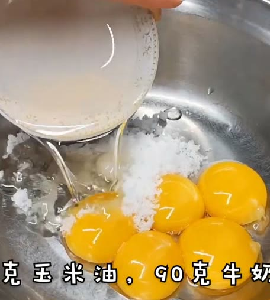
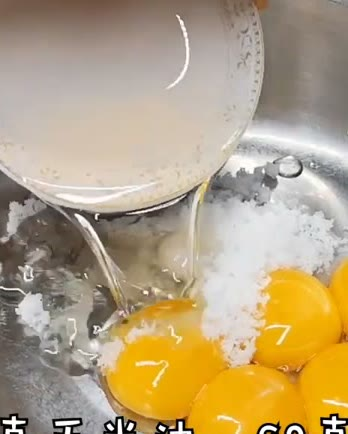
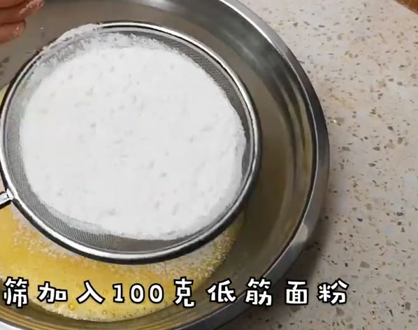
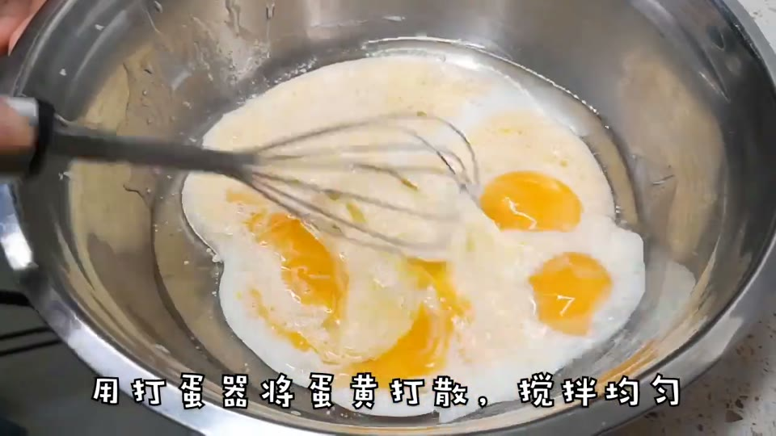
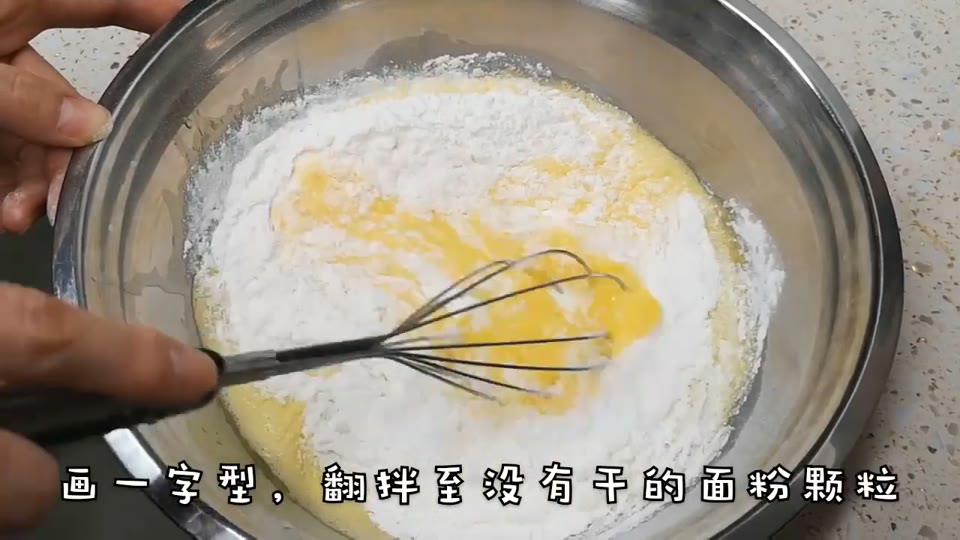
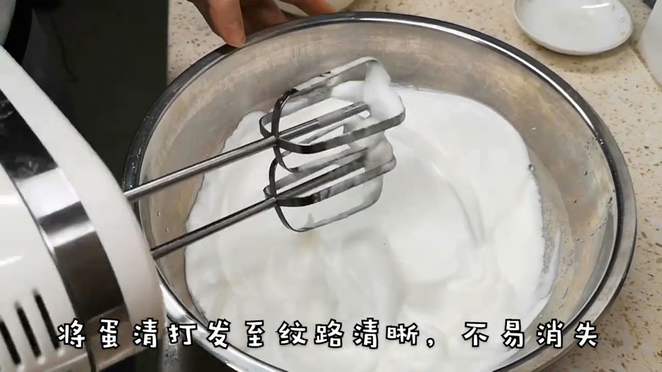
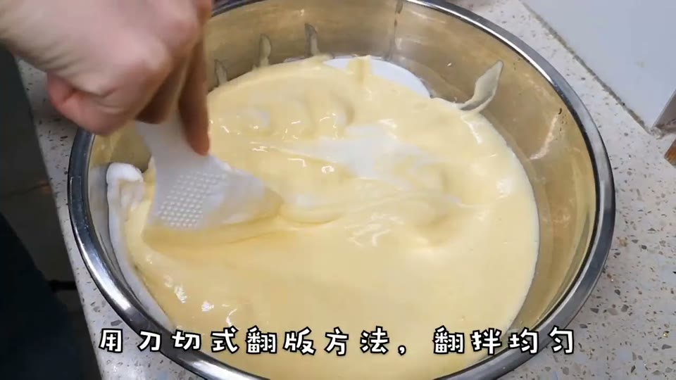

# 松软香甜的戚风蛋糕

> 份量：4人份 ｜ 来源：https://www.youtube.com/watch?v=R-J1THaPWU8

## 食材
- 鸡蛋 · 5个 
- 白糖 · 20克（蛋黄）+45克（蛋白）
- 玉米油 · 45克 
- 牛奶 · 90克 
- 低筋面粉 · 100克 

## 步骤
### 第 1 步 · 分离蛋清和蛋黄
将五个鸡蛋的蛋清和蛋黄分别打入两个无水无油的盆内。

**🤔 为什么这么做**
- 原理：蛋清和蛋黄分离是为了分别处理。蛋清用于打发成蛋白霜提供蓬松度，而蛋黄则用来制作蛋糕糊的基础。
- 不这么做：如果混合在一起，无法有效地将空气打入蛋清中，导致蛋糕不够蓬松；同时蛋黄会干扰蛋白的打发过程。
- 怎么判断到位：观察两个盆内的成分是否完全分离且没有杂质。

### 第 2 步 · 搅拌蛋黄
在蛋黄盆中加入20克白糖、45克玉米油和90克牛奶，用打蛋器将鸡蛋打散。

**🤔 为什么这么做**
- 原理：搅拌蛋黄是为了将糖和油均匀地混合到蛋液中，促进乳化作用。乳化可以增加蛋糕的湿润度。
- 不这么做：不充分搅拌会导致面糊中的油脂与水分无法完全融合，影响蛋糕的口感和质地。
- 怎么判断到位：观察蛋黄是否变得光滑且体积略有膨胀。

### 第 3 步 · 筛入低筋面粉  🟡 需留意
过筛加入100克低筋面粉，用一字型翻拌方法搅拌至没有干的面粉颗粒。

**🤔 为什么这么做**
- 原理：筛入低筋面粉是为了去除结块，确保面粉均匀分布。同时，使用一字型翻拌方法可以避免面粉起筋。
- 不这么做：不筛粉会导致面糊中有颗粒状的面粉团块，影响蛋糕口感；过度搅拌则会使面粉产生筋性，导致蛋糕变硬。
- 怎么判断到位：观察面糊是否顺滑且没有干粉粒。

### 第 4 步 · 打发蛋白  🔴 新手雷区
在蛋清盆中滴两滴柠檬汁，用电动打蛋器低速打发至冒大泡后加入15克白糖。继续打发至泡沫变细腻再加15克白糖，直至出现纹路时加入最后的15克白糖。

**🤔 为什么这么做**
- 原理：打发蛋白是为了将空气打入蛋清中，形成稳定的泡沫结构。这一步是蛋糕蓬松的关键。
- 不这么做：不充分打发会导致蛋糕不够膨松；过度搅拌则会让蛋白霜变得脆弱且容易塌陷。
- 怎么判断到位：观察蛋白是否能拉出尖角或倒扣盆时不会流动。

### 第 5 步 · 混合蛋黄和蛋白  🔴 新手雷区
将三分之一打发好的蛋白倒入蛋黄碗内，用刀切式翻拌方法搅拌均匀。然后将全部蛋糊倒回装蛋白的盆中，继续用同样的方式搅拌。

**🤔 为什么这么做**
- 原理：混合蛋黄和打发的蛋白是为了将蓬松的蛋白霜与蛋黄糊均匀结合，同时减少面糊消泡的风险。
- 不这么做：不正确地搅拌会导致蛋白消泡，影响蛋糕的膨松度；过度搅拌则会让蛋白霜变得过于脆弱。
- 怎么判断到位：观察混合后的面糊是否轻盈且没有明显的蛋白块或蛋黄液。

### 第 6 步 · 准备模具
在蛋糕模具内刷一层油，倒入蛋糊，轻轻震动几下以震出气泡。

**🤔 为什么这么做**
- 原理：在模具内刷油是为了让蛋糕更容易脱模，同时可以防止粘底。
- 不这么做：不刷油会导致蛋糕底部与模具粘连，难以取出；过多的油则会影响蛋糕表面质感。
- 怎么判断到位：观察模具是否均匀涂抹了一层薄薄的油膜。

### 第 7 步 · 烘烤蛋糕  🔴 新手雷区
将烤箱调至160度，预热5分钟后放入模具。在中层以上下火160度烘烤40分钟。

`火候：上下火 ｜ 油温：160℃ ｜ 时间：40分钟`

**🤔 为什么这么做**
- 原理：烘烤是通过高温使面糊中的水分蒸发，并且让蛋白质和淀粉发生变性，形成蛋糕结构。
- 不这么做：温度过高会导致表面过快结壳而内部未熟；温度过低则可能导致蛋糕不够蓬松或塌陷。
- 怎么判断到位：观察蛋糕是否膨胀并呈现出金黄色的表皮。

### 第 8 步 · 取出蛋糕  🟡 需留意
烤好后将蛋糕轻轻震动一下，然后倒扣在烤架上放凉。

**🤔 为什么这么做**
- 原理：轻轻震动烤好的蛋糕是为了震出内部的大气泡，使蛋糕更加均匀和松软。
- 不这么做：不震动会导致底部有大气孔或塌陷；过度震动则可能导致蛋糕破裂。
- 怎么判断到位：观察蛋糕是否表面平整且没有明显的凹陷。

### 第 9 步 · 脱模
蛋糕完全冷却后，从模具中取出。

**🤔 为什么这么做**
- 原理：完全冷却后再脱模是为了防止热气导致蛋糕塌陷或粘连模具，影响外观和口感。
- 不这么做：未完全冷却就脱模可能导致蛋糕内部结构不稳定而塌陷；过早脱模也可能使蛋糕与模具粘连难以取出。
- 怎么判断到位：观察蛋糕是否已经完全降温至室温且表面不再热烫。

---
*由庖丁自动解析生成，讲解仅供参考，请以实际烹饪为准。*