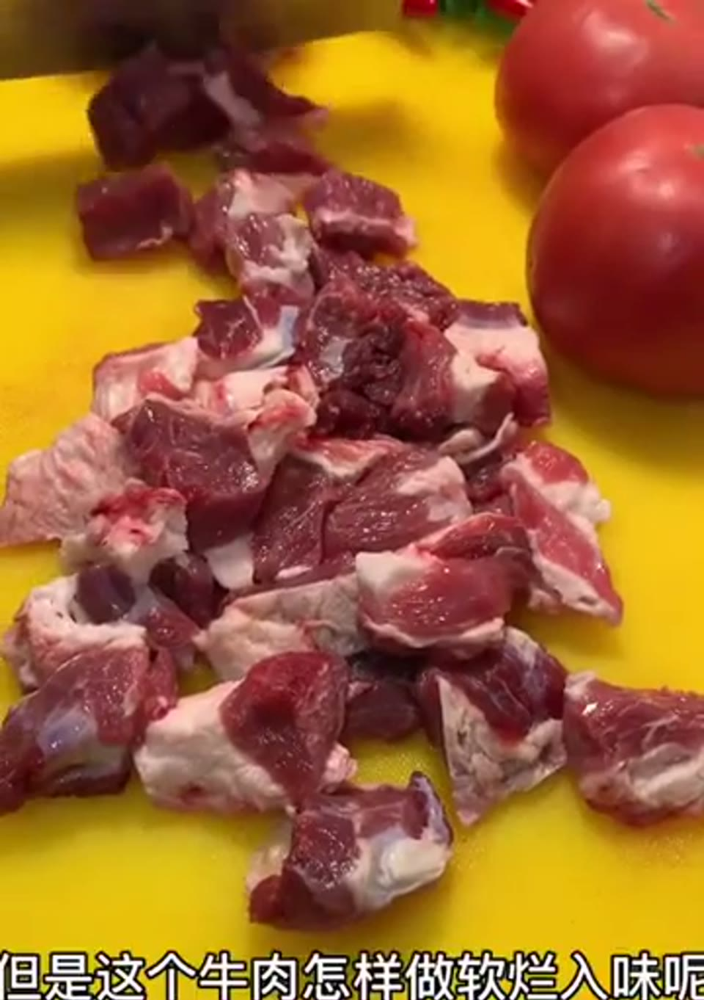
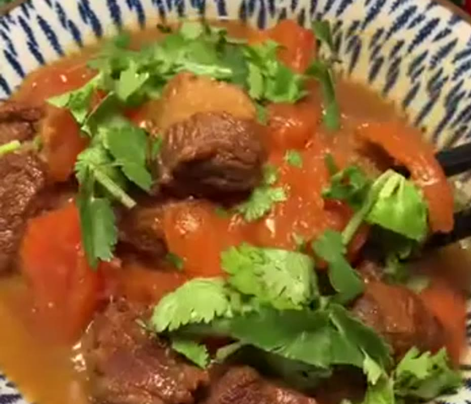
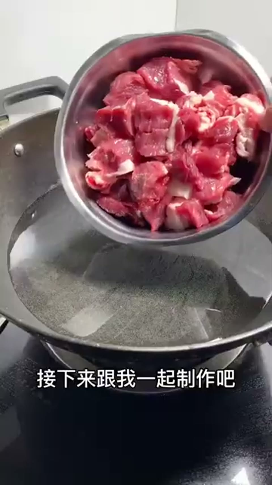
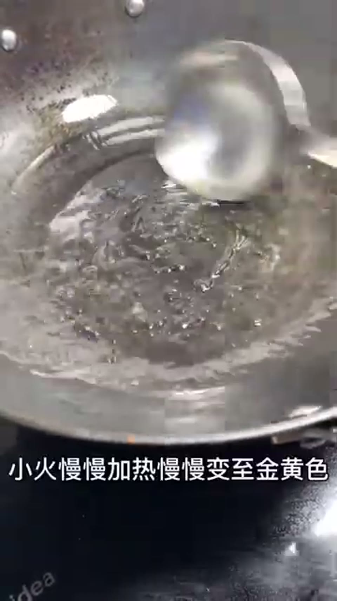
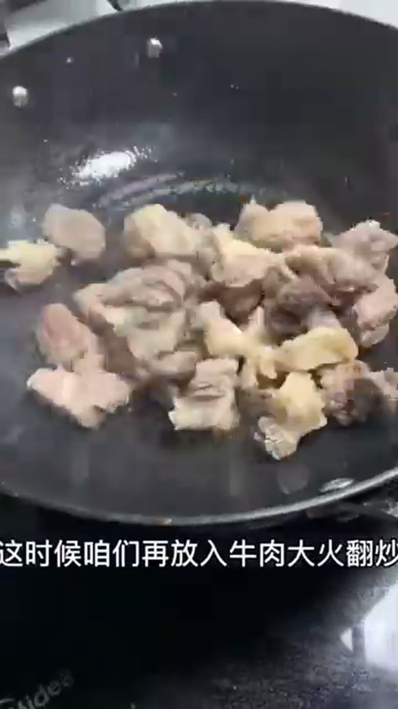
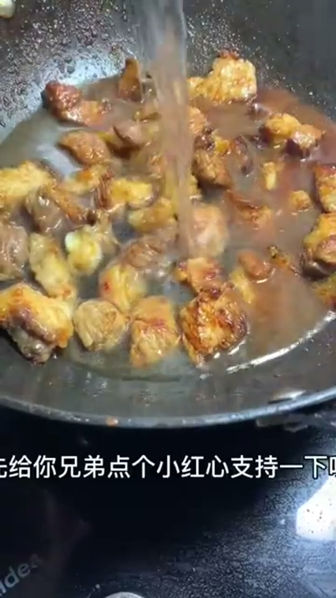
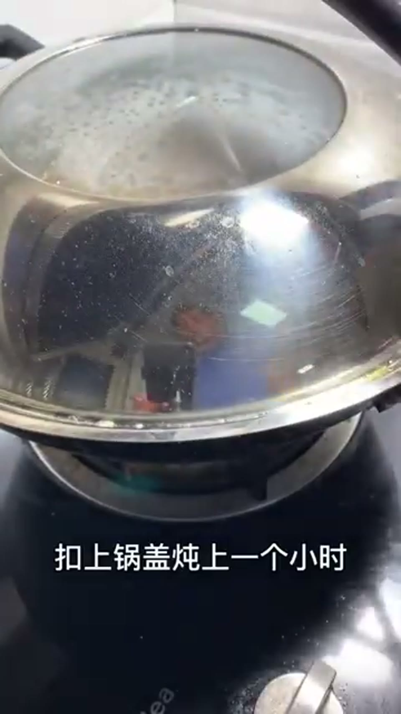

# 西红柿炖牛腩

> 份量：4人份 ｜ 来源：https://www.youtube.com/watch?v=bFv3MNsoGgA

## 食材
- 牛肉 · 适量 
- 西红柿 · 若干个 
- 香料包 · 一个（包含八角、小茴香、桂皮、橘子皮、山楂片、花椒、白芷（转写作「白纸」，已按烹饪常识纠正）、辣椒。）
- 料酒 · 适量
- 生抽 · 适量
- 葱姜 · 适量

## 步骤
### 第 1 步 · 准备牛肉  🟡 需留意
将牛肉切成大块，凉水下锅加一点料酒煮出血沫。煮出血水后用凉水冲洗几遍。

**🤔 为什么这么做**
- 原理：将牛肉切块并在凉水中煮出血沫，可以去除肉中的血水、杂质和异味。这样可以让炖出来的牛腩更加鲜美。
- 不这么做：如果没有这一步，牛腩会带有腥味，并且口感可能会比较粗糙。
- 怎么判断到位：观察锅中是否出现浮沫并及时撇去。

### 第 2 步 · 炒糖色  🔴 新手雷区
小火慢炒几块冰糖，慢慢加热至金黄色。

`火候：小火 ｜ 到位：变成枣红色`

**🤔 为什么这么做 ⚠️ 讲解置信度中**
- 原理：炒糖色是为了给牛肉上色，增加菜肴的色泽和风味。通过小火慢炒冰糖，可以避免糖色变苦或糊掉。
- 不这么做：如果不这样做，牛腩的颜色会比较暗淡，缺乏光泽。
- 怎么判断到位：观察锅中的糖慢慢融化并变成枣红色。

### 第 3 步 · 炖牛肉  🔴 新手雷区
放入处理好的牛肉，大火翻炒至汤汁包裹在牛肉上。

`火候：大火`

**🤔 为什么这么做 ⚠️ 讲解置信度中**
- 原理：大火翻炒牛肉可以让肉块表面迅速形成一层焦壳，锁住内部的水分和鲜味。同时，汤汁包裹在牛肉上有助于后续炖煮时更加入味。
- 不这么做：如果不这样做，牛腩可能会发干、变老，影响口感。
- 怎么判断到位：观察锅中是否产生足够的热气，并且肉块表面变得微焦。

### 第 4 步 · 调味
加入适量生抽和料酒，继续翻炒。

**🤔 为什么这么做**
- 原理：加入生抽和料酒是为了给牛肉调味，增加菜肴的鲜味。同时，这些调料也有助于去腥增香。
- 不这么做：如果不这样做，牛腩的味道会比较淡。
- 怎么判断到位：观察锅中汤汁的颜色是否变深，且肉块表面有明显的酱色。

### 第 5 步 · 炖煮  🟡 需留意
加开水，放入适量葱姜和香料包。用高压锅或普通炒锅炖一个小时。

`时间：1小时`

**🤔 为什么这么做**
- 原理：加开水炖煮可以让牛肉更加嫩滑。高压锅可以更快地将肉炖烂，而普通炒锅则需要更长时间来慢慢炖制。
- 不这么做：如果不这样做，牛腩可能会比较硬，不容易炖烂。
- 怎么判断到位：观察汤汁是否逐渐变浓，并且肉块变得软糯。

### 第 6 步 · 处理西红柿
西红柿中间拉十字刀，用开水烫一下去皮切块。

**🤔 为什么这么做**
- 原理：西红柿去皮切块是为了更容易入味和烹饪。开水烫一下可以去掉表皮，方便后续处理。
- 不这么做：如果不这样做，西红柿可能会比较难炖烂，并且影响菜肴的美观度。
- 怎么判断到位：观察西红柿是否已经完全去皮并且切成合适的大小。

### 第 7 步 · 炖西红柿
挑出调料包，放入西红柿继续炖五分钟。

`时间：5分钟`

**🤔 为什么这么做**
- 原理：加入西红柿可以让汤汁更加鲜美，同时也能使菜肴的颜色更丰富。继续炖煮五分钟是为了让西红柿的味道充分融入牛肉中。
- 不这么做：如果不这样做，牛腩的口感可能会比较单调，缺少酸甜味。
- 怎么判断到位：观察锅中的汤汁是否呈现浓郁的红色，并且西红柿已经软烂。

---
*由庖丁自动解析生成，讲解仅供参考，请以实际烹饪为准。*